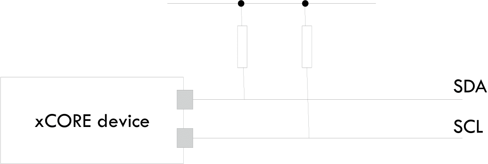
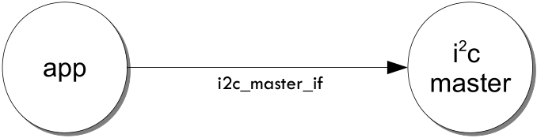
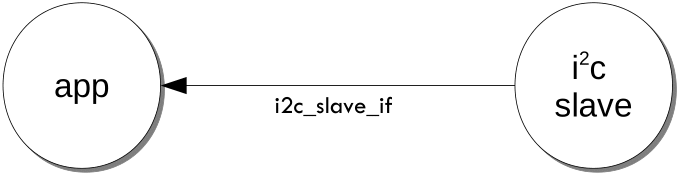

####################
lib_i2c: I²C library
####################

************
Introduction
************

``lib_i2c`` provides a software defined, industry-standard, I²C library that allows control of an
I²C bus via `xcore` ports.
I²C is a two-wire hardware serial interface, first developed by Philips.
``lib_i2c`` provides both controller (“master”) and peripheral (“slave”) functionality.

``lib_i2c`` is compatible with multiple slave devices existing on the same bus.
The I²C master component can be used by multiple tasks within the `xcore` device
(each addressing the same or different slave devices).

``lib_i2c`` can also be used to implement multiple I²C physical interfaces on a single `xcore`
device simultaneously.

``lib_i2c`` is intended to be used with the `XCommon CMake <https://www.xmos.com/file/xcommon-cmake-documentation/?version=latest>`_
, the `XMOS` application build and dependency management system.

To use this library, include ``lib_i2c`` in the application's ``APP_DEPENDENT_MODULES`` list in
`CMakeLists.txt`, for example::

    set(APP_DEPENDENT_MODULES "lib_i2c")

Applications should then include the ``i2c.h`` header file.

***************************
External signal description
***************************

All signals are designed to comply with the timings in the I²C specification found here:

http://www.nxp.com/documents/user_manual/UM10204.pdf

Note that the following optional parts of the I²C specification are *not* supported:

  * Multi-master arbitration
  * 10-bit slave addressing
  * General call addressing
  * Software reset
  * START byte
  * Device ID
  * Fast-mode Plus, High-speed mode, Ultra Fast-mode

I²C consists of two signals: a clock line`(`SCL`) and a data line
(`SDA`). Both of these signals are *open-drain* and require external
resistors to pull the line up if no device is driving the signal
down. The correct value for the resistors can be found in the I²C
specification.

   I²C open-drain layout

Transactions on the line occur between a *master* and a *slave*. The
master always drives the clock (though the slave can delay the
transaction at any point by holding the clock line down). The master
initiates a transaction with a start bit (consisting of driving the
data line from high to low whilst the clock line is high). It will
then clock out a seven-bit device address followed by a read/write
bit. The master will then drive one more clock pulse during which the
slave can either `ACK` (drive the line low), accepting the transaction
or `NACK` (leave the line high). This sequence is shown in :ref:`i2c_transaction_start`.

.. _i2c_transaction_start:

.. figure:: images/transaction_start.png
   :width: 100%

   I²C transaction start

If the read/write bit of the transaction start is 1 then the master
will execute a sequence of reads. Each read consists of the master
driving the clock whilst the slave drives the data for 8-bits (most
significant bit first). At the end of each byte, the master drives
another clock pulse and will either drive either an `ACK` (0) or
`NACK` (1) signal on the data line. When the master drives a `NACK`
signal, the sequence of reads is complete. A read byte sequence is
show in :ref:`i2c_read_byte`

.. _i2c_read_byte:

.. figure:: images/read_byte.png
   :width: 100%

   I²C read byte

|newpage|

If the read/write bit of the transaction start is 0 then the master
will execute a sequence of writes. Each write consists of the master
driving the clock whilst and also driving the data for 8-bits (most
significant bit first). At the end of each byte, the master drives
another clock pulse and the slave will either drive either an `ACK` (0)
(signalling that it can accept more data) or a `NACK` (1) (signalling
that it cannot accept more data) on the data line. After the `ACK`/`NACK`
signal, the master can complete the transaction with a stop bit or
repeated start. A write byte sequence is show in :ref:`i2c_write_byte`

.. _i2c_write_byte:

   I²C write byte

After a transaction is complete, the master may start a new
transaction (a *repeated start*) or will send a
stop bit consisting of releasing the data line so that it floats from low to high whilst
the clock line is high (see :ref:`i2c_stop_bit`).

.. _i2c_stop_bit:

   I²C stop bit

|newpage|

Connecting to the `xcore` device
================================

When the `xcore` is the I²C master, the normal configuration is to
connect the clock and data lines to different 1-bit ports as shown in
:ref:`i2c_master_1_bit`.

.. _i2c_master_1_bit:

.. figure:: images/i2c_master_1_bit.png
  :width: 40%

  I²C master (1-bit ports)

It is possible to connect both lines to different bits of a multi-bit
port as shown in :ref:`i2c_master_n_bit`. This is useful if other
constraints limit the use of one bit ports. However the following
should be taken into account:

  * L-series and U-series devices do not support this configuration,
  * The other bits of the multi-bit port cannot be used for any other
    function.

.. _i2c_master_n_bit:

.. figure:: images/i2c_master_n_bit.png
  :width: 40%

  I²C master (single n-bit port)

When the `xcore` is acting as I²C slave the two lines *must* be
connected to two 1-bit ports (as shown in :ref:`i2c_slave_connection`).

.. _i2c_slave_connection:

  I²C slave connection

************************
I²C master library usage
************************

There are two types of interface for I²C masters: synchronous and asynchronous.

I²C master synchronous operation
================================

The synchronous API provides blocking operation. Whenever a client makes a
read or write call the operation will complete before the client can
move on - this will occupy the core that the client code is running on
until the end of the operation. This method is easy to use, has low
resource use and is very suitable for applications such as setup and
configuration of attached peripherals.

I²C masters are instantiated as parallel tasks that run in a
``par`` statement. For synchronous operation, the application
can connect via an interface connection using the ``i2c_master_if``
interface type:

   I²C master task diagram

For example, the following code instantiates an I²C master and connects to it

.. literalinclude:: ../../examples/app_simple_synchronous_master/src/simple_synchronous_master.xc
   :start-at: port p_scl
   :end-before: void my_application

For the single multi-bit port version of I²C the
top level instantiation would look like

.. literalinclude:: ../../examples/app_simple_single_port_master/src/simple_single_port_master.xc
   :start-at: port p_i2c
   :end-before: void my_application

Note that the connection is an array of interfaces, so several tasks
can connect to the same master.

|newpage|

The application can use the client end of the interface connection to
perform I²C bus operations e.g.

.. literalinclude:: ../../examples/app_simple_synchronous_master/src/simple_synchronous_master.xc
   :start-at: void my_application(client i2c_master_if i2c, uint8_t target_device_addr) {
   :end-before: // end

Here the operations such as ``i2c.read`` will
block until the operation is completed on the bus.
More information on interfaces and tasks can be be found in
the `XMOS Programming Guide <https://www.xmos.com/download/XMOS-Programming-Guide-(documentation)(E).pdf>`_. By default the
I²C synchronous master mode component does not use any logical cores of its
own. It is a *distributed* task which means it will perform its
function on the logical core of the application task connected to
it (provided the application task is on the same tile as the I²C ports).

I²C master asynchronous operation
=================================

The synchronous API will block the application until the bus
operation is complete. In cases where the application cannot afford to
wait for this long the asynchronous API can be used.

The asynchronous API offloads operations to another task. Calls are
provided to initiate reads and writes. Notifications are provided
when the operation completes. This API requires more management in the
application but can provide much more efficient operation.
It is particularly suitable for applications where the I²C bus is
being used for continuous data transfer.

Setting up an asynchronous I²C master component is done in the same
manner as the synchronous component.

.. literalinclude:: ../../examples/app_simple_asynchronous_master/src/simple_asynchronous_master.xc
   :start-at: port p_scl
   :end-before: void my_application

|newpage|

The application can then use the asynchronous API to offload bus
operations to the I²C master. For example, the following code
repeatedly calculates *BUFFER_BYTES* bytes to send over the bus.

.. literalinclude:: ../../examples/app_simple_asynchronous_master/src/simple_asynchronous_master.xc
   :start-at: void my_application(client i2c_master_async_if i2c, uint8_t target_device_addr) {
   :end-before: void my_application_handle_bus_error

Here the calculation of ``my_application_fill_buffer`` will overlap with
the sending of data by the other task.

Repeated start bits
===================

The library supports repeated start bits. The ``read`` and ``write``
functions allow the application to specify whether to send a stop bit
at the end of the transaction. If this is set to ``0`` then no stop
bit is sent and the next transaction will begin with a repeated start
bit e.g.

.. literalinclude:: ../../examples/app_simple_repeated_start_master/src/simple_repeated_start_master.xc
   :start-at: void my_application(client i2c_master_if i2c, uint8_t target_device_addr) {
   :end-before: // end

Note that if no stop bit is sent then no other client using the
same I²C master can send or receive data. They will block until a stop
bit is sent.

|newpage|

***********************
I²C slave library usage
***********************

I²C slaves are instantiated as parallel tasks that run in a
``par`` statement. The application can connect via an interface
connection.

   I²C slave task diagram

For example, the following code instantiates an I²C slave
and connects to it.

.. literalinclude:: ../../examples/app_simple_slave/src/simple_slave.xc
   :start-at: port p_scl
   :end-before: void my_application

|newpage|

The slave acts as the client of the interface
connection. This means it can "callback" to the application to respond
to requests from the bus master. For example, the ``my_application``
function above needs to respond to the calls e.g.

.. literalinclude:: ../../examples/app_simple_slave/src/simple_slave.xc
   :start-at: void my_application(server i2c_slave_callback_if i2c) {
   :end-before: // end

More information on interfaces and tasks can be be found in the `XMOS Programming Guide <https://www.xmos.com/download/XMOS-Programming-Guide-(documentation)(E).pdf>`_.

**********
Master API
**********

All I²C master functions can be accessed via the ``i2c.h`` header::

  #include "i2c.h"

``lib_i2c`` should also be included in the application's ``APP_DEPENDENT_MODULES`` list in
`CMakeLists.txt`, for example::

    set(APP_DEPENDENT_MODULES "lib_i2c")

Creating an I²C master instance
===============================

.. doxygenfunction:: i2c_master

|newpage|

.. doxygenfunction:: i2c_master_single_port

|newpage|

.. doxygenfunction:: i2c_master_async

|newpage|

.. doxygenfunction:: i2c_master_async_comb

|newpage|

I²C master supporting typedefs
==============================

.. doxygenenum:: i2c_res_t

.. doxygenenum:: i2c_regop_res_t

|newpage|

I²C master synchronous interface
================================

.. doxygengroup:: i2c_master_if

|newpage|

I²C master asynchronous interface
=================================

.. doxygengroup:: i2c_master_async_if

*********
Slave API
*********

All I²C slave functions can be accessed via the ``i2c.h`` header::

  #include "i2c.h"

``lib_i2c`` should also be included in the application's ``APP_DEPENDENT_MODULES`` list in
`CMakeLists.txt`, for example::

    set(APP_DEPENDENT_MODULES "lib_i2c")

|newpage|

Creating an I²C slave instance
==============================

.. doxygenfunction:: i2c_slave

|newpage|

I²C slave interface
===================

.. doxygengroup:: i2c_slave_callback_if

